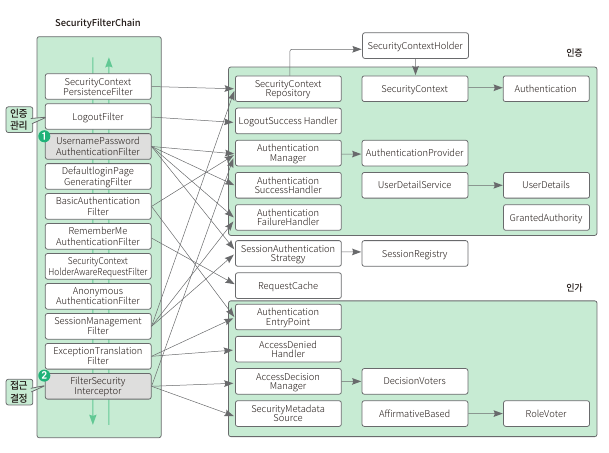
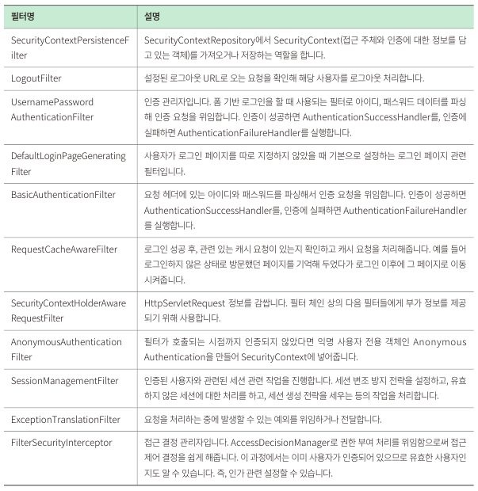
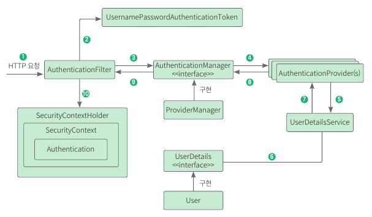

## [목록으로](README.md)

## 8. 스프링 시큐리티로 로그인/로그아웃, 회원 가입 구현하기

### 8.1 사전 지식: 스프링 시큐리티

* 스프링 시큐리티는 스프링 기반의 애플리케이션 보안(인증, 인가, 권한)을 담당하는 스프링 하위 프레임워크

> <u>인증과 인가</u>
> * 인증은 사용자의 신원을 입증하는 과정
> * 인가는 사이트의 특정 부분에 접근할 수 있는지에 권한을 확인하는 작업

> <u>스프링 시큐리티</u>
> * 스프링 기바 애플리케이션의 보안을 담당하는 스프링 하위 프레임워크
> * CSRF 공격, 세션 고정 공격을 방어해주고, 요청 헤더도 보안 처리

> 아이디와 패스워드 기반 폼 로그인을 시도하면 스프링 시큐리티에서는 어떠한 절차로 인증 처리 하는지 그림으로 확인
> 
> 
> 
> 1. 사용자가 폼에 아이디와 패스워드를 입력하면, HTTPServletRequest 에 아이디와 비밀번호 정보가 전달, 이때  AuthenticationFilter 가 넘어온 아이디와 비밀번호의 유효성 검사
> 2. 유효성 검사가 끝나면 실제 구현체인 UsernamePasswordAuthenticationToken 을 만들어 넘겨줌
> 3. 전달받은 인증용 객체인 UsernamePasswordAuthenticationToken 을 AuthenticationManager 에게 보냄
> 4. UsernamePasswordAuthenticationToken 을 AuthenticationProvider 에 보냄
> 5. 사용자 아이디를 UserDetailService 에 보내며, UserDetailService 는 사용자 아이디로 찾은 사용자의 정보를 UserDetails 객체로 만들어 AuthenticationProvider 에게 전달
> 6. DB에 있는 사용자 정보를 가져옴
> 7. 입력 정보와 UserDetails 정보를 비교해서 실제 인증 처리
> 8. 8 ~ 10 까지 인증이 완료되면 SecurityContextHolder 에 Authentication 저장. 인증 성공 여부에 따라 성공하면 AuthenticationSuccessHandler, 실패하면 AuthenticationFailureHandler 핸들러 실행

### 8.2 회원 도메인 만들기

* 스프링 시큐리티를 사용해 인증, 인가 기능 구현
  * 회원 정보를 저장할 테이블을 만들고 테이블과 연결할 도메인 생성
  * 이 테이블과 연결할 회원 엔티티 생성
  * 회원 엔티티와 연결되어 데이터를 조회해줄 리포지터리 생성
  * 스프링 시큐리티에서 사용자 정보를 가져오는 서비스 구현
  
#### 8.2.1 의존성 추가하기

1. build.gradle 의존성 추가

#### 8.2.2 엔티티 만들기

* 회원 엔티티 생성

1. domain 패키지에 User.java 파일 생성

#### 8.2.3 리포지터리 만들기

1. repository 디렉터리에 UserRepository.java 파일 생성

#### 8.2.4 서비스 메서드 코드 작성하기

1. service 디렉터리에 UserDetailService.java 파일 생성

