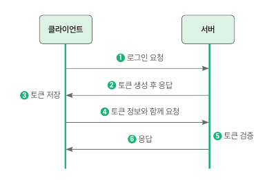
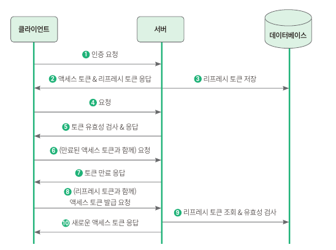

## [목록으로](README.md)

## 9. JWT 로 로그인/로그아웃 구현하기

### 9.1 사전 지식: 토큰 기반 인증

#### 9.1.1 토큰 기반 인증이란?

* 사용자가 서버에 접근할 때 이 사용자가 인증된 사용자인지 확인하는 방법은 다양하며 대표적인 사용자 인증 확인 방법에는 서버 기반 인증과 토큰 기반 인증
* 스프링 시큐리티에서는 기본적으로 세션 기반 인증 제공하며, 사용자의 정보를 담은 세션을 생성하고 저장해서 인증 처리
* 토큰은 서버에서 클라이언트를 구분하기 위한 유일한 값인데 서버가 토큰을 생성해서 클라이언트에게 제공하면, 클라이언트는 이 토큰을 갖고 있다가 여러 요청을 이 토큰과 함께 신청하며 서버는 토큰만 보고 유효한 사용자인지 검증

<u>토큰을 전달하고 인증 받는 과정</u>

1. 클라이언트가 아이디와 비밀번호를 서버에게 전달하면서 인증을 요청
2. 서버는 아이디와 비밀번호를 확인해 유효한 사용자인지 검증하고, 유효한 사용자면 토큰을 생성해서 응답
3. 클라이언트는 서버에서 준 토큰을 저장
4. 이후 인증이 필요한 API를 사용할 때 토큰을 함께 전달
5. 서버는 토큰이 유효한지 검증
6. 토큰이 유효하다면 클라이언트가 요청한 내용을 처리

<u>토큰 기반 인증의 특징</u>

무상태성

  * 사용자의 인증 정보가 담겨 있는 토큰이 서버가 아닌 클라이언트에 있으므로 서버에 저장할 필요가 없음
  * 서버에 뭔가 데이터를 유지하고 있으려면 그만큼 자원을 소비하지만, 토큰 기반 인증에서는 클라이언트에서 인증 정보가 담긴 토큰을 생성하고 인증
  * 클라이언트에서는 사용자의 인증 상태를 유지하면서 이후 요청을 처리해야 하는데 이것을 상태를 관리한다라고 정의
  * 서버 입장에서는 클라이언트의 인증 정보를 저장하거나 유지하지 않아도 되기 때문에 완전한 무상태로 효율적인 검증 가능

확장성

  * 무상태성은 확장성에 영향
  * 서버를 확장할 때 상태 관리를 신경 쓸 필요가 없으니 서버 확장에도 용이

무결성

  * 토큰 방식은 HMAC (hash-based message authentication) 기법이라고도 부르며 토큰을 발급한 이후에는 토큰 정보를 변경하는 행위는 불가
  * 만약 누군가 토큰을 한 글자라도 변경하면 서버에서는 유효하지 않은 토큰이라고 판단

### 9.1.2 JWT

* 발급받은 JWT를 이용해 인증을 하려면 HTTP 요청 헤더 중에 Authorization 키값에 Bearer + JWT 토큰값을 넣어 전송
* JWT는 .을 기준으로 헤더(header), 내용(payload), 서명(signature) 로 구성 => aaaaa.bbbbb.ccccc
* 헤더에는 토큰의 타입과 해싱 알고리즘을 지정하는 정보를 저장
* 내용에는 토큰과 관련된 정보를 담으며, 내용의 한 덩어리를 클래임 (claim) 이라고 부르며 클레임은 키 값의 한 쌍으로 구성
* 서명은 해당 토큰이 조작되었거나 변경되지 않았음을 확인하는 용도로 사용되며, 헤더의 인코딩 값과 내용의 인코딩 값을 합치 후에 주어진 비밀키를 사용해 해시값을 생성

<u>토큰 유효기간</u>

* 토큰은 이미 발급되면 그 자체로 인증 수단이 되므로 서버는 토큰과 함께 들어온 요청이 토큰을 탈취한 사람의 요청인지 확인 불가

리프레시 토큰이 있다면?

* 토큰의 유효기간이 짧으면 사용자 입장에서는 받은 토큰을 너무 짧은 시간만 활요할 수 있으니 불편하며 이러한 불편한 지점을 해결하기 위해 리프레시 토큰이 등장
* 리프레시 토큰은 액세스 토큰과 별개의 토큰이며 사용자를 인증하기 위한 용도가 아닌 액세스 토큰이 만료되었을 때 새로운 액세스 토큰을 발급하기 위해 사용

1. 클라이언트가 서버에게 인증을 요청
2. 서버는 클라이언트에서 전달한 정보를 바탕으로 인증 정보가 유효한지 확인한 뒤, 액세스 토큰과 리프레시 토큰을 만들어 클라이언트에게 전달하며 클라이언트는 전달받은 토큰을 저장
3. 서버에서 생성한 리프레시 토큰은 DB에도 저장
4. 인증을 필요로 하는 API를 호출할 때 클라이언트에서 저장된 액세스 토큰과 함께 API를 요청
5. 서버에서 전달받은 액세스 토큰이 유효한지 검사한 뒤에 유효하다면 클라이언트에서 요청한 내용을 처리
6. 시간이 지나고 액세스 토큰이 만료된 뒤에 클라리언트에서 원하는 정보를 얻기 위해 서버에게 API 요청을 보냄
7. 서버에서 액세스 토큰이 유효한지 검사하며 만료된 토큰이면 유효하지 않기 때문에 토큰이 만료되었다는 에러를 전달
8. 클라이언트에서는 이 응답을 받고 저장해둔 리프레시 토큰과 함께 새로운 액세스 토큰을 발급하는 요청을 전송
9. 서버에서는 전달받은 리프레시 토큰이 유효한지, DB에서 리프레시 토큰을 조회한 후 저장해둔 리프레시 토큰과 같은지 확인
10. 유효한 리프레시 토큰이라면 새로운 액세스 토큰을 생성한 뒤 응답하며 그 이후에 클라이언트는 4번과 같이 다시 API 요청

### 9.2 JWT 서비스 구현하기

* JWT를 생성하고, 검증하는 서비스 구현
* 의존성과 토큰 제공자를 추가하고 나서 리프레시 토큰 도메인과 토큰 필터를 구현하면 JWT 서비스를 사용할 준비 완료

9.2.1 의존성 추가하기

1. build.gradle 의존성 추가

9.2.2 토큰 제공자 추가하기

* jwt를 사용해서 JWT 생성하고 유효한 토큰인지 검증하는 역할을 하는 클래스를 추가

1. JWT 토큰을 만들려면 이슈 발급자, 비밀키를 필수로 설정
2. 해당 값들을 변수로 접근하는 데 사용할 JwtProperties 클래스 생성
3. 토큰을 생성하고, 올바른 토큰인지 유효성 검사를 하고, 토큰에서 필요한 정보를 가져오는 클래스 작성
4. 코드가 제대로 동작하는지 확인하기 위해 테스트 코드 작성
5. TokenPrivider 클래스를 테스트하는 클래스 생성
